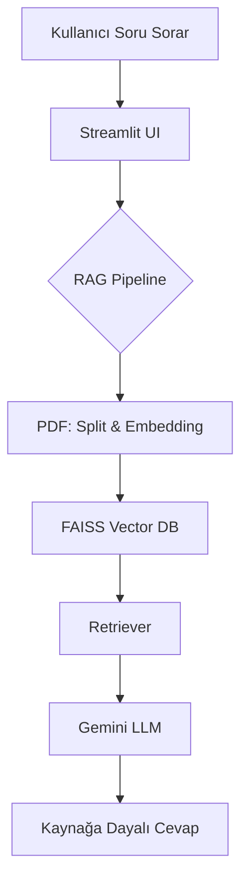

# 💊 Eczacı SUT Asistanı


**PDF Tabanlı RAG + LangChain + Gemini Yapay Zeka Klinik Bilgi Sorgulama Sistemi**

Bu proje, **eczacılık SUT dokümanını (`pharmacy.pdf`) temel alarak tıbbi sorulara PDF içeriğinden yanıt veren akıllı bir yapay zeka sistemidir.**

Arka planda **RAG (Retrieval-Augmented Generation)** mimarisi kullanır; yani model ezbere cevap vermez, yanıtı önce PDF’te arar, bulamazsa uydurma yapmaz.

Proje; sağlık, regülasyon, hukuki doküman taraması ve klinik bilgi sorgulama gibi alanlarda **LLM + belge tabanlı bilgi erişimi** uygulamalarının pratik bir örneğidir.

---

## 🔥 Bu Proje Ne Öğretiyor?

* **Veri İşleme:** PDF veri yükleme ve parçalama (`PyPDFLoader` + `TextSplitter`)
* **Vektör Uzayı:** Embedding üretme (`GoogleGenerativeAIEmbeddings`)
* **Veritabanı:** Vektör veritabanı oluşturma (`FAISS Vector Store`)
* **AI Zinciri:** RAG zinciri kurma (`Retriever` + `Prompt` + `Gemini LLM`)
* **Frontend:** Kullanıcı arayüzü geliştirme (`Streamlit`)
* **UI/UX:** WhatsApp benzeri grid yapı ile Chat UI tasarımı
* **Güvenlik:** Prompt Safety & Hallucination (Halüsinasyon) önleme kuralları

---

## 📌 Proje Özeti

> **Çalışma Mantığı:** Soru sor → PDF taranır → İlgili sayfalar bulunur → Gemini cevap üretir → Arayüzde gösterilir.
>
> ⚠️ **Not:** Model sadece dokümana dayalı konuşur. Dokümanda bilgi yoksa *"dökümanda bilgi bulamıyorum"* der. Bu, güven gerektiren medikal projelerde kritik bir davranıştır.

---

## 🏗 Mimarinin Basit Şeması


---

## 🚀 Kurulum 
# Depoyu İndir
```bash
git clone https://github.com/ekenk/eczaci-sut-asistani.git
cd eczaci-sut-asistani
```
# Sanal Ortam Kurulumu
Kütüphanelerin karışmaması için sanal ortam kullanın:

```Bash
# Windows için:
python -m venv venv
venv\Scripts\activate

# Mac/Linux için:
python3 -m venv venv
source venv/bin/activate
```
# Gereksinimleri Yükle
```Bash
pip install -r requirements.txt
```
# API Key Tanımla
Ana dizinde .env adında bir dosya oluşturun ve içine Google API Key ekleyin:

```Ini, TOML
GOOGLE_API_KEY="your api key"
```
# Uygulamayı Çalıştır
```Bash
streamlit run app.py
```
Komutu çalıştırdıktan sonra tarayıcı otomatik açılır ve Chat ekranı karşınıza gelir.

## 🎨 Kullanıcı Arayüzü
📱 Mesajlaşma Düzeni: WhatsApp benzeri baloncuk yapısı.

⬅️ Asistan: Sol tarafta, renkli ikonlu.

➡️ Kullanıcı: Sağ tarafta.

✨ Tasarım: Modern, responsive ve karanlık mod uyumlu.


## 📁 Dosya Yapısı
```Bash
📦 eczaci-sut-asistani
├─ app.py                 # UI + RAG Zinciri + Prompt Yönetimi
├─ pharmacy.pdf           # SUT Bilgi Kaynağı (Veri)
├─ gemini_basic_rag.ipynb # Geliştirme ve Test Notebook'u
├─ .env                   # API Key (Gizli Dosya)
├─ requirements.txt       # Kütüphane Listesi
└─ README.md              # Proje Dokümantasyonu
```

## 🧠 Kodun Ana Fikri (En Sade Anlatım)
```Python

# 1- PDF yüklenir
docs = PyPDFLoader("pharmacy.pdf").load()

# 2- Parçalara ayrılır
chunks = RecursiveCharacterTextSplitter(chunk_size=1000).split_documents(docs)

# 3- Embedding üretilir
embeddings = GoogleGenerativeAIEmbeddings(model="models/gemini-embedding-001")

# 4- Vektör veritabanı kurulur
db = FAISS.from_documents(chunks, embeddings)

# 5- Soru geldiğinde benzer parçalar aranır
retriever = db.as_retriever()

# 6- Gemini modele context sağlanır → yanıt oluşturur
answer = RAG_chain.invoke("anti-tnf hangi hekim tarafından kullanılır?")
```

## 🔍 Notebook ile Çalıştırmak İsteyenler İçin
```gemini_basic_rag.ipynb``` dosyası şunları içerir:

✔ Embedding (Vektör) testleri

✔ PDF chunk (parça) görüntüleme

✔ Manuel soru-cevap denemeleri

✔ Yanıtları inceleme & hata ayıklama


## 🔮 Gelecek Geliştirme Önerileri
- Çoklu PDF yükleme desteği

- Session Memory (Sohbet geçmişini hatırlama)

- Klinik bilgi sınıflandırma modülü

## 📝 Lisans

Bu proje açık kaynak kodludur.

## 👤 Geliştirici
Kadir Eken
